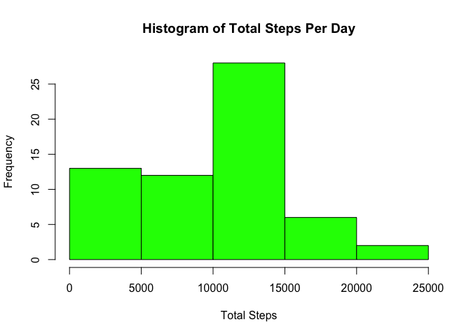
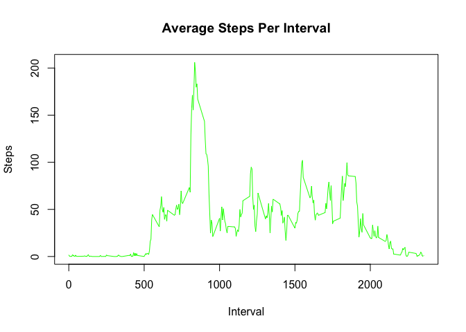
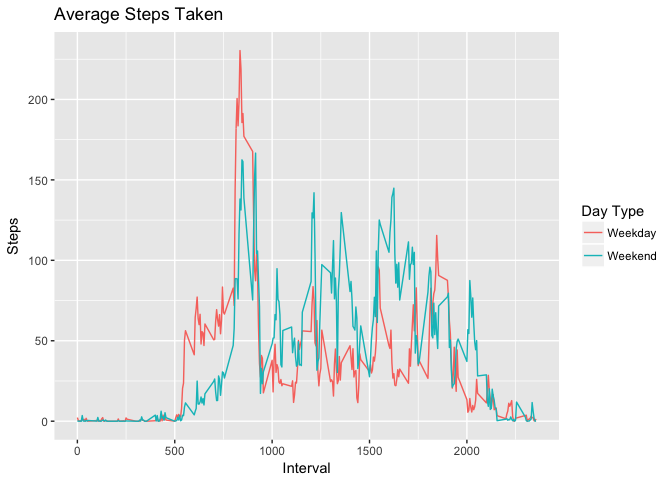

## Loading libraries

```r
library(dplyr)
library(ggplot2)
```


## Loading and preprocessing the data

```r
unzip('activity.zip')
activity <- read.csv('activity.csv')
```


## What is mean total number of steps taken per day?

```r
totalStepsPerDay <- with(activity, tapply(steps, date, sum, na.rm = TRUE))
hist(totalStepsPerDay, col = 'green', xlab = 'Total Steps', main = 'Histogram of Total Steps Per Day')
```

<!-- -->

### Summary of the total steps per day (mean and median included)

```r
summary(totalStepsPerDay)
```

```
##    Min. 1st Qu.  Median    Mean 3rd Qu.    Max. 
##       0    6778   10395    9354   12811   21194
```


## What is the average daily activity pattern?

```r
avgSteps <- activity %>% group_by(interval) %>% summarise(mean = mean(steps, na.rm = TRUE))
plot(avgSteps, type = 'l', col = 'green', xlab = 'Interval', ylab = 'Steps', main = 'Average Steps Per Interval')
```

<!-- -->

### The interval with the maximum average steps is:

```r
avgSteps[which.max(avgSteps$mean), 1]
```

```
## # A tibble: 1 x 1
##   interval
##      <int>
## 1      835
```


## Imputing missing values
### Total number of missing values

```r
sum(is.na(activity$steps))
```

```
## [1] 2304
```

### Filling `NA` step values with the average of the same interval

```r
newActivity <- merge(activity, avgSteps) %>% 
  mutate(steps = if_else(is.na(steps), mean, as.double(steps))) %>% 
  select(-mean)
```

### Total steps by day

```r
newTotalStepsPerDay <- with(newActivity, tapply(steps, date, sum))
hist(newTotalStepsPerDay, col = 'green', xlab = 'Total Steps', main = 'Histogram of Total Steps By Day')
```

<!-- -->

### Summary of the total steps per day (mean and median included)

```r
summary(newTotalStepsPerDay)
```

```
##    Min. 1st Qu.  Median    Mean 3rd Qu.    Max. 
##      41    9819   10766   10766   12811   21194
```

### Impact
The mean has increased and the histogram now resembles that of a normal distribution.

## Are there differences in activity patterns between weekdays and weekends?
### Adding a new varible to `newActivity` to indicate whether an entry is of a weekend or weekday day

```r
newActivity <- newActivity %>% mutate(date = as.Date(as.character(date), '%Y-%m-%d')) %>% 
  mutate(dayType = as.factor(if_else(weekdays(date) %in% c('Saturday', 'Sunday'), 'Weekend', 'Weekday')))
```

```
## Warning in strptime(x, format, tz = "GMT"): unknown timezone 'zone/tz/
## 2017c.1.0/zoneinfo/Asia/Ho_Chi_Minh'
```

### Average steps taken per interval for weekday vs. weekend

```r
avgSteps <- newActivity %>% group_by(dayType, interval) %>% summarise(mean = mean(steps))
ggplot(data = avgSteps, aes(interval, mean, group = dayType)) +
  geom_line(aes(col = dayType)) +
  labs(x = 'Interval', y = 'Steps', title = 'Average Steps Taken', colour = 'Day Type')
```

<!-- -->
